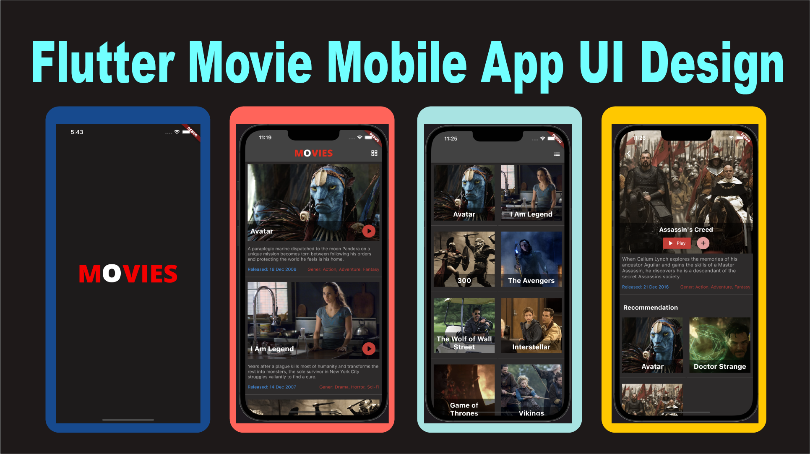

# Flutter Movies Mobile Application Responsive UI

<ul>
<li> Splash Screen</li>
<li> Gridview Movies Screen </li>
<li> Listview Movies Screen </li>
<li> Toggle Button to Switch between screens </li>
<li> Movie Details Screen </li>
<li> Lottie Animations </li>
<li> smailar interests movies </li>
<li> carousel slider </li>
</ul>
